#   Cog-Eva-MRC handbook
## :pushpin: What is Cog-Eva-MRC
**Cog-Eva-MRC** 

is the first integrated and evaluated platform for Machine Reading Comprehension(MRC). 

Existing accuracy-based evaluation of many NLP tasks has low interpretability, and cannot reflect the problem-solving ability of the model similar to human text understanding and reasoning . To address this issue, there comes cognitive skill analysis that provides the explanation corresponding to human processing .So, We built an MRC cognitive evaluation platform that provides thirteen cognitive skills to address these issues.The demonstration video is available at [there.](https://github.com)

### :house: Overview
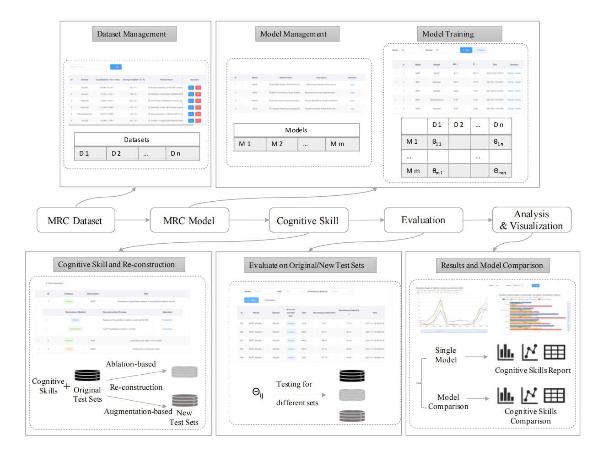
#### The architecture of Cog-Eva-MRC platform
Our system consists of four parts, which are *Dataset Management*,*Model Management*, *cognitive Skill*,*Fine-grained Evaluation* .
*   *Dataset Management* manages your dataset and you can do some basic operations, such as add, delete, update and search.
*   *Model management* module can view the model details provided by the system, and configure the hyperparameter training model on the system.
*   *Cognitive skill* module can view the details of cognitive skill, and can also select cognitive skill to reconstruct the dataset of interest.
*   *Fine-grained Evaluation* module select the corresponding cognitive skill to evaluate the model, and the evaluation results will be displayed in the form of tables and graphs.

### :couple: Audiences
* **Researchers:** Cog-Eva-MRC can easily help you to view the baseline model of MRC task, and provide fine-grained evaluation analysis of the model.
* **New to MRC:** Cog-Eva-MRC can quickly help you understand the process of mrc tasks, and can also make you understand the model more clearly through fine-grained analysis.

## :loudspeaker: How to use
* **Dataset Management:**
  The data management module stores the popular MRC public dataset. Similarly, to serve the data upload function, users can upload the dataset that need to be used in this module.

1. Information of data
   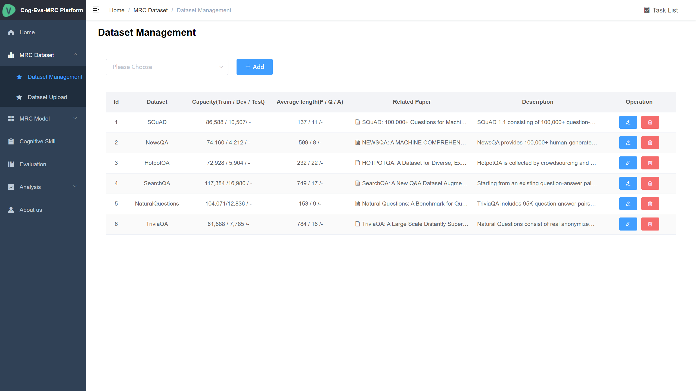

   Dataset management displays the datasets stored in Cog-Eva-MRC, and Users can view the dataset they are interested in and the details of the corresponding dataset. 
   Besides Cog-Eva-MRC provides data modification and data deletion capabilities.

2. Add the data
   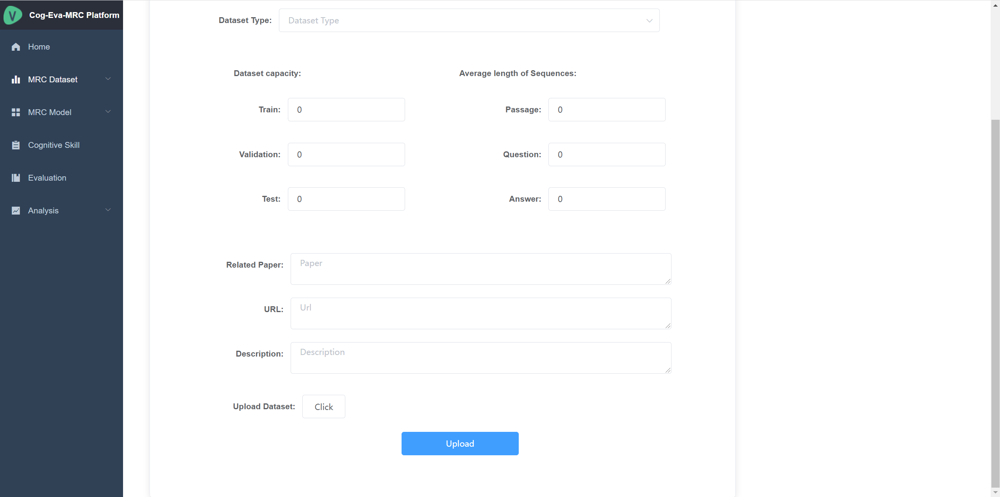

   Cog-Eva-MRC Provide dataset upload function to facilitate users to upload other datasets . Please note that the upload conforms to the system specification.

* **Model Management:**

  The model management module provides a number of classic baseline models in MRC. Users can configure hyperparameters for training on the system, and the training status and trained results will be displayed on the Cog-Eva-MRC.

1. Information of Model
     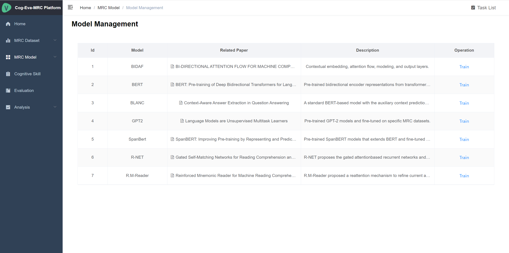

   Model management displays the model integrated in Cog-Eva-MRC. Users can view the details of the model and select the model and dataset they are interested in to customize the hyperparameters for training .

2. Trained Model
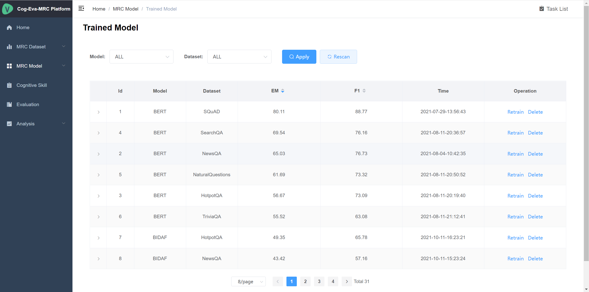

   Users can view trained models, see their details, and remove Them with no need for trained models parameter.

* **Cognitive Skill:**
  
    Cognitive skill is an evaluation method for MRC tasks based on the combination of semantics and MRC tasks
    
1. Cognitive Skill
   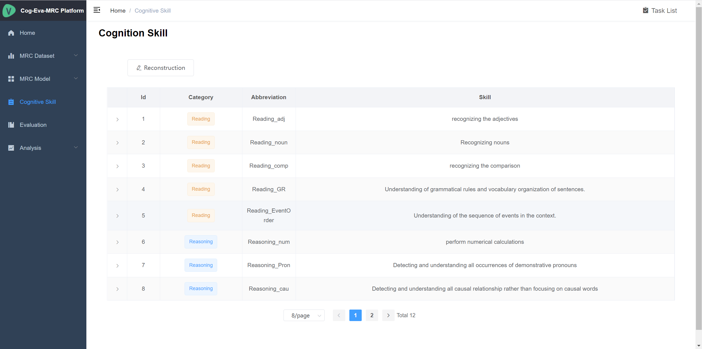

    The cognitive Skill module presents the details of thirteen cognitive Skills based on grammatical knowledge and presents details of the Ablation/Augmentation reconstruction methods for each cognitive skill .
  
2. Reconstruction
    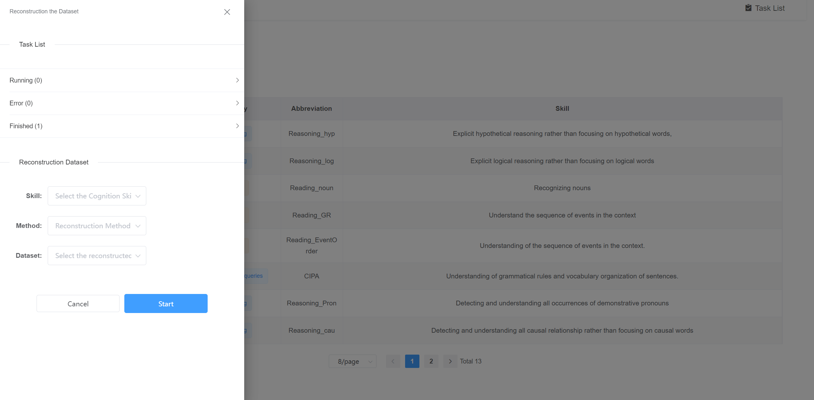
   Users can perform Reconstruction on the dataset, and select the cognitive skill reconstruction method of interest through the selection box. Reconstruct the dataset.

* **Fine-grained evaluation:**
1. Evaluation
     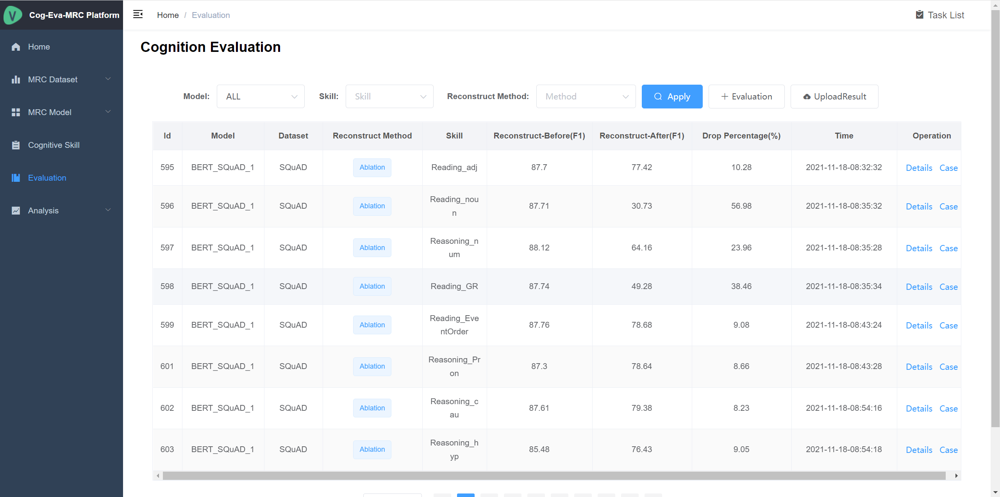
   The Evaluation module can view the results and details of fine-grained evaluation of the model. In addition, users can click the Evaluation button to select the model, dataset and cognitive skill to be tested and evaluated in the filter box
2. User Interface
   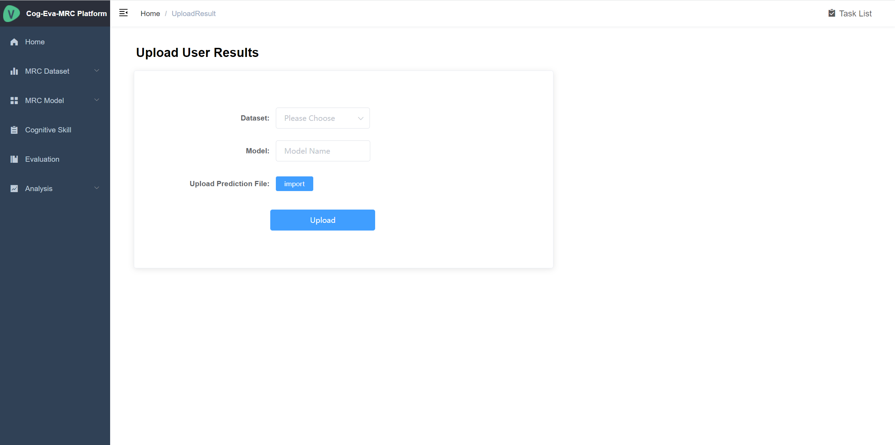
   Users can upload the predicted results of the model and give corresponding information, so that they can use our platform to complete the analysis and visualization of the model

3. Analysis
   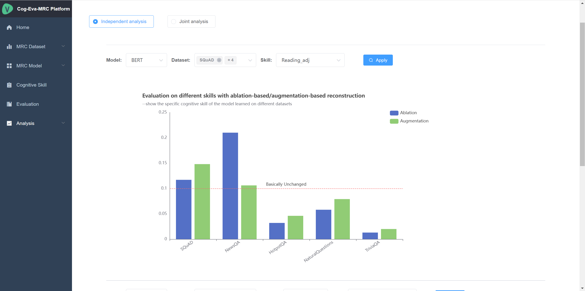
     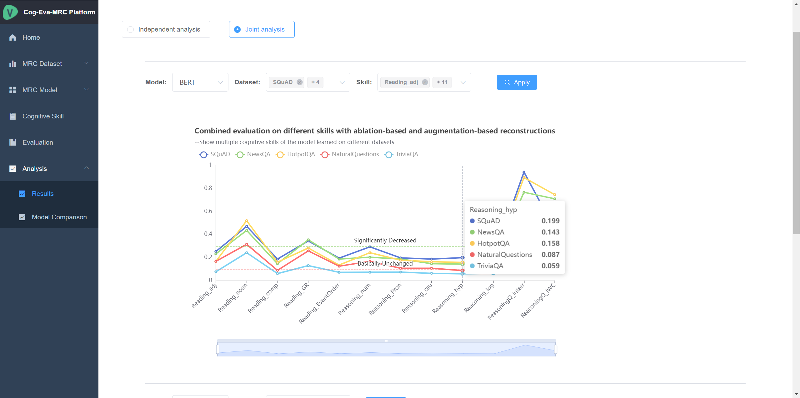
    The analysis module visually displays the fine-grained analysis of a single model and the comparison of fine-grained analysis results between multiple models. Users can easily analyze models and compare differences between models.

##  :hammer: Install

After updating...

## :question: FAQ

After updating...

